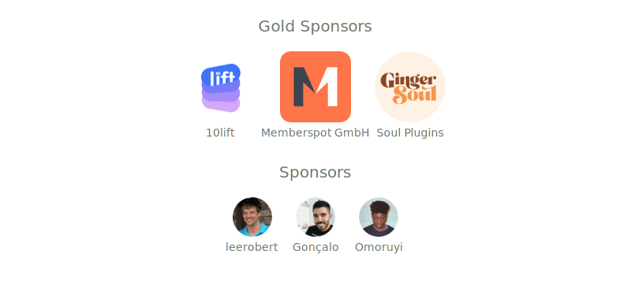

# notitap-pro

Pro version of Notion like editor built on top of [Tiptap](https://tiptap.dev/). Will be open sourced when I have 10 sponsors ❤️.

A ⭐️ to the repo if you 👍 / ❤️  what I'm doing would be much appreciated. If you're using this extension and making money from it, it'd be very kind of you to **[:heart: Sponsor me](https://github.com/sponsors/sereneinserenade)**. If you're looking for a **dev to work you on your project's Rich Text Editor** with or as **a frontend developer, [DM me on Discord/Twitter/LinkedIn](https://github.com/sereneinserenade)👨‍💻🤩**.

I've made a bunch of extensions for Tiptap 2, some of them are **Resiable Images And Videos**, **Search and Replace**, **LanguageTool integration** with tiptap. You can check it our here https://github.com/sereneinserenade#a-glance-of-my-projects.

> **Note**: This is __React version__. Vue3 version will be coming 🔜

## Demo:

Visit https://sereneinserenade.github.io/notitap-secret/ for a live demo.

  
 <h4> Click to see the video </h4> 

  https://user-images.githubusercontent.com/45892659/184548594-125208cb-b55b-4e3d-90a0-0b259eb1e102.mp4

## Sponsors:

**This project is made possible thanks to these amazing orgs/people.**

## Contributing

**[:heart: Sponsor me](https://github.com/sponsors/sereneinserenade)** to make it possible for me to work on . You can also show your ❤️ by ⭐️ing this repository. Your support means a lot.

Clone the repo, do something, make a PR. You know what's the drill. Looking forward to your PRs, you amazing devs.

## Stargazers

